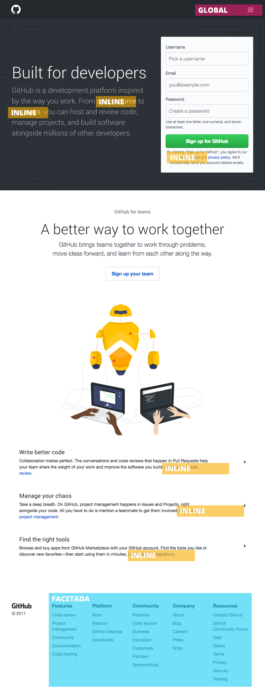
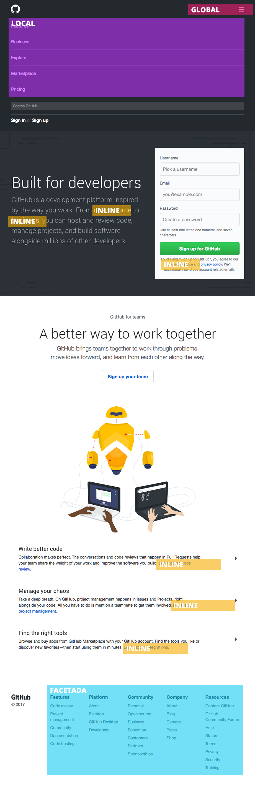
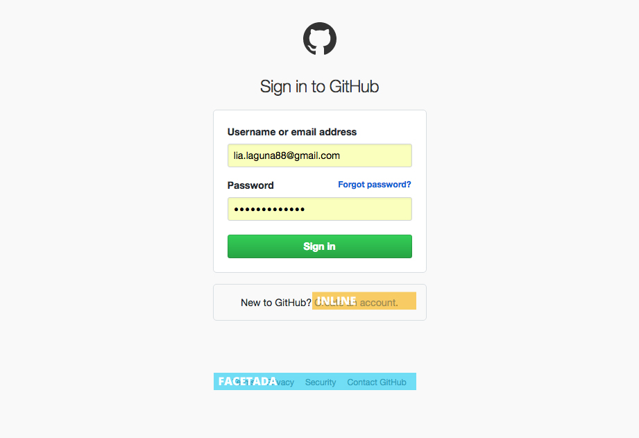
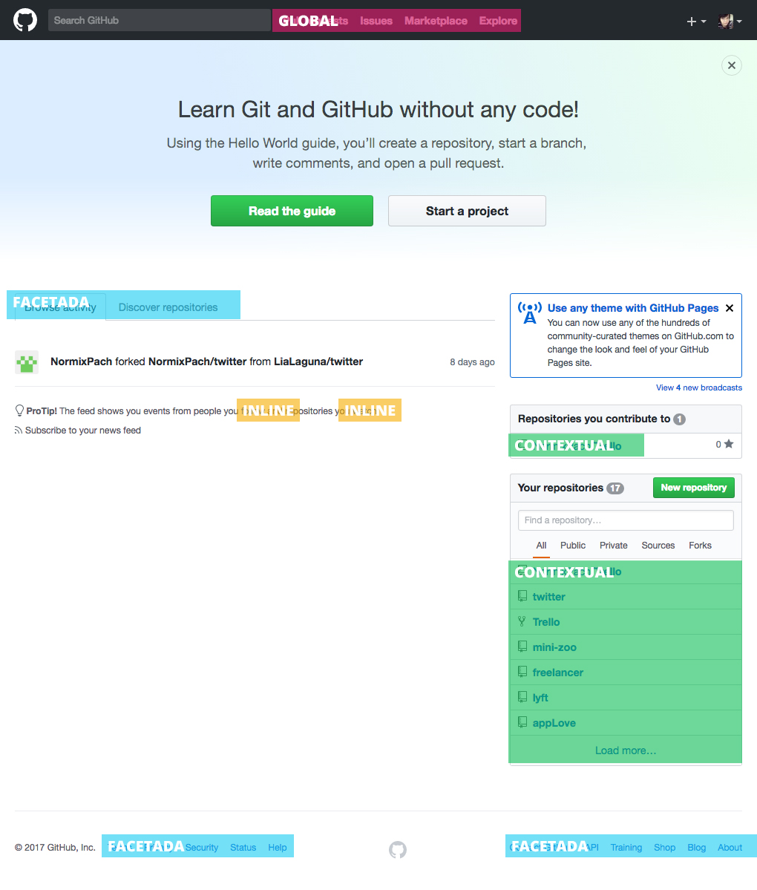
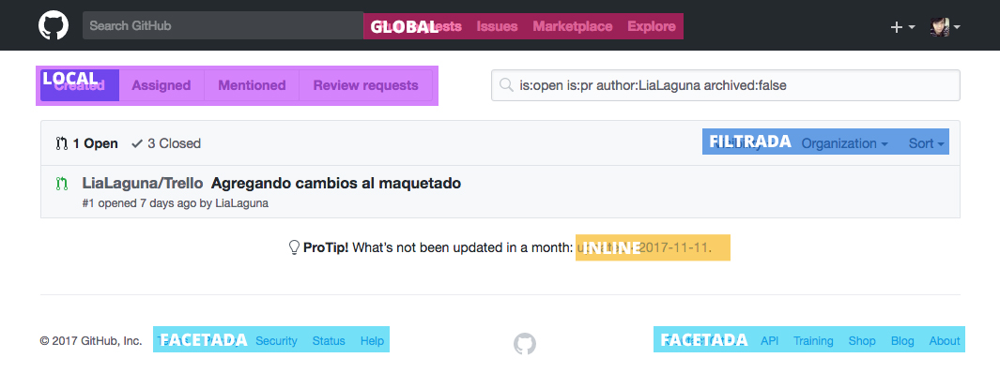
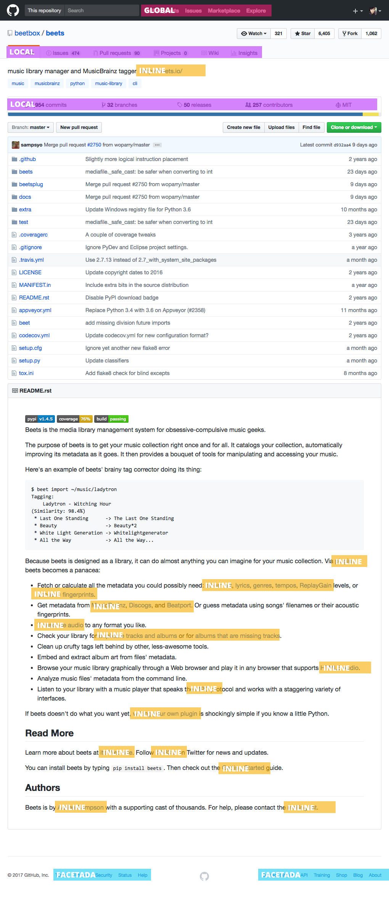

# RETOS
## UNIDAD 2: INTRO A USER EXPERIENCE DESIGN

## · Explica las partes qué conforman el UX y qué partes UI de la página de Laboratoria.

### UX
1. Investigación
2. Log in
3. Tipo de escritura
4. Diseño de interacción
5. Arquitectura de la información
6. Copywriting

### UI
1. Diseño de la interfaz
2. Diseño visual
  - Color
  - Tipografía
  - Imágenes
  - Íconos

## · Identifica los elementos de navegación del sitio de Github.

## · Sketch para la herramienta del dashboard de Laboratoria.

https://marvelapp.com/5b9749i
